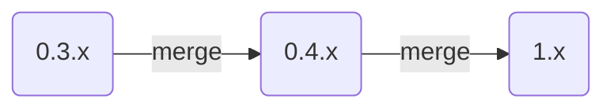
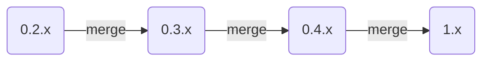
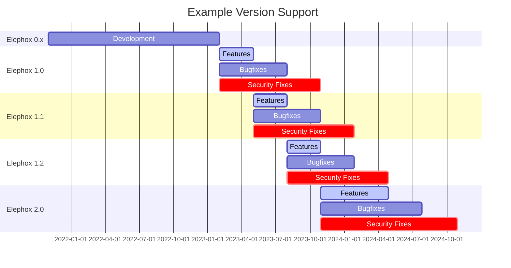

<section class="hero is-primary">
  

    
Contributing

    
Workflow

  

</section>

<!---{? set title = "Workflow @ Elephox" }-->

[toc]

---

# Setting up git

# git workflow

# Version management

| branch        | corresponding series | aliases                       | example tag |
|---------------|:--------------------:|-------------------------------|-------------|
| `main`        |        `1.x`         | `next-major`                  | `1.0.0`     |
| `develop`     |       `0.4.x`        | `next-minor`                  | `0.4.0`     |
| `release-0.3` |       `0.3.x`        | `latest-minor`, `only-bugfix` | `0.3.25`    |
| `release-0.2` |       `0.2.x`        | `last-minor`, `only-security` | `0.2.13`    |

In case of a bugfix commit:

In case of a security fix commit:

