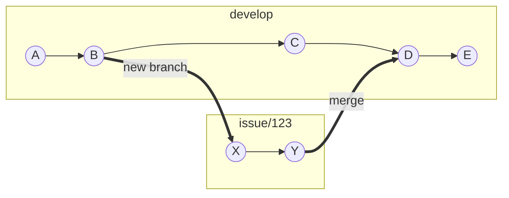
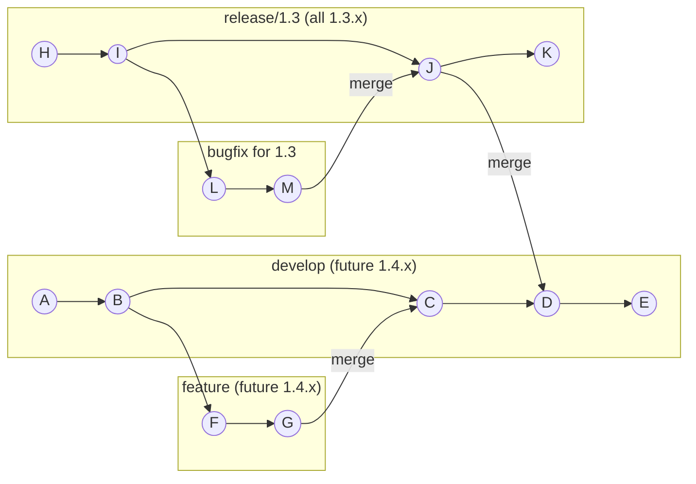
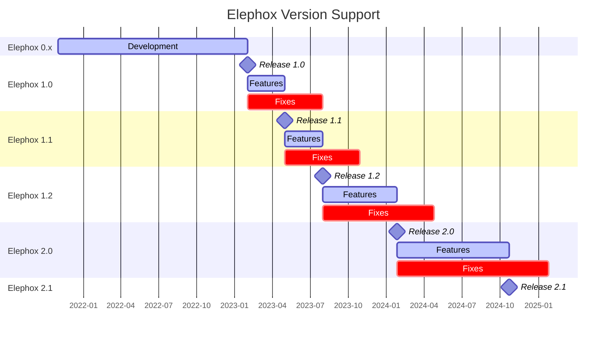

<section class="hero is-primary">
  <div class="hero-body">
    <p class="title">Contributing</p>
    <p class="subtitle">Workflow</p>
  </div>
</section>

<!---{? set title = "Workflow @ Elephox" }-->

[toc]

---

# Setting up git

1. Install git from their official website: [git-scm.com/downloads](https://git-scm.com/downloads)
2. If you haven't already, create a new GitHub user: [github.com/signup](https://github.com/signup)
3. Set up your name and email address in git (they will be used for commits and pull requests):

```
$ git config --global user.name "Your Name"
$ git config --global user.email "Your Email"
```

# Issue workflow

If you have been assigned an issue, you have to use the following workflow:

1. Create a branch for your issue. Prefix the branch name with `issue/` and the issue number.  
   For example if you have an issue with number `123`, the branch name will be `issue/123`.  
   The base for your branch depends on the issue type:

3. Do your commits on this branch and push then regularly. Fix any issues that come up in the CI pipeline.
4. Open a pull request on GitHub, from your issue branch into the `develop` branch.
5. Once the PR is reviewed, merge it. The issue should then be closed.
6. Afterwards, a new version can be published

An example of how your development might look like:



# Version management

| branch        | corresponding series | aliases  | example tag |
|---------------|:--------------------:|----------|-------------|
| `develop`     |       `1.4.x`        | `next`   | `1.4-RC1`   |
| `release/1.3` |       `1.3.x`        | `latest` | `1.3.25`    |
| `release/1.2` |       `1.2.x`        | `-`      | `1.2.13`    |

When a pull request is merged into branch `release/1.3`, the tag `1.3.25` must be created.
Subsequently, the branch `release/1.3` must be merged into `develop`.




